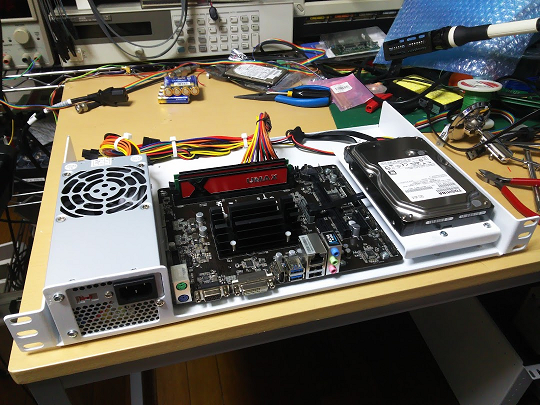
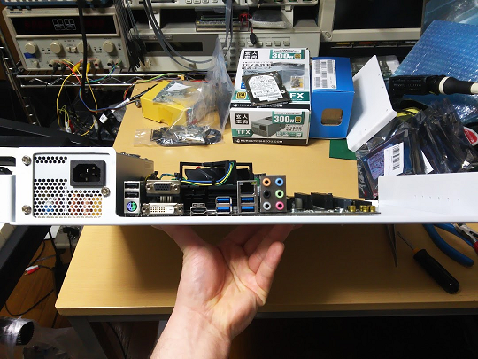
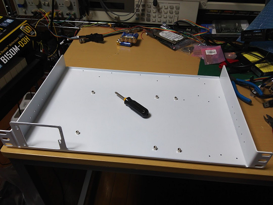
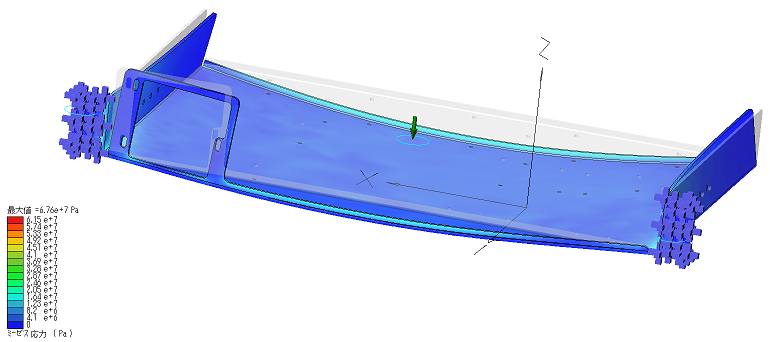

# Simple 19'' Rack Mount Chassis

##Whats?
This is a simple and cheap 19 '' rack mount chassis for your home server room.
All ports and connectors are placed to the front.

You can make this copy or improved at a nearby sheet metal factory.

##Spec.

- Sheet Metal: t2.3 Bonderizing Plate (popular name in Japan :: ボンデ鋼板)
- Mountable PC Parts:
	PowerSupply: TFX Spec.
    MotherBoard: MicroATX
    HDD: 3.5''  x1 (due to HDD Mount Blacket)
    

## Album

1 HDD Model Assy. (Main Chassis and HDD Bracket)
White painted for rust inhibiting.

Disk less assembly. Front View.

White painted blank Chassis.

## Deflection Analysis

Rack mounted, apply 20N (2kgf) on center of chassis : amount of maximum displacement 0.329mm
just about... within the allowable range...

##Design Environment
- 3DCAD: Geomagic Design
- FEA: SimWise4D

## Revisions
* rev.0 FirstDesign
